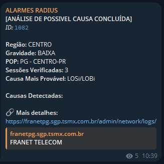
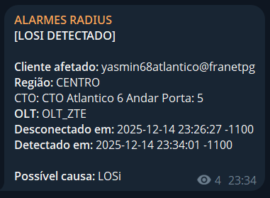

# Especificação Técnica
## Monitoramento Radius

---

## 1. VISÃO GERAL

Monitor Radius é uma solução de monitoramento inteligente que detecta automaticamente anomalias de conectividade em tempo real, permitindo resposta rápida a incidentes que afetam os clientes.

### 1.1 Casos de Uso
- Identificação rápida de quedas regionais de rede
- Análise de possivel causa de queda regional (LOS, LOSi/LOBi, DyingGasp etc)
- Monitoramento de picos anormais de desconexões
- Acompanhamento de resolução de incidentes
- Detecção de atenuações e rompimentos individuais

---

## 2. IMPLANTAÇÃO

### 2.1 Integração SGP

Feita a partir do cadastro de um Token de acesso à API. [Guia e documentação própria do SGP ↗](https://bookstack.sgp.net.br/books/api/page/autenticacoes-via-api#bkmrk-02-%7C-token-e-app)

**Pré-requisitos:**
- **Token e App:** Cadastrados no SGP, exemplo: radius-monitor e 111000-a1b2-c3d4-e5f6-12345678abc
- **URL SGP:** URL padrão do SGP do provedor, exemplo: https://meuprovedor.sgp.tsmx.com.br

---

## 3. ESPECIFICAÇÕES TÉCNICAS

### 3.1 Tipos de Notificação e Precisão de Detecção

**1. Alerta de Alto Volume de Desconexões**
- Disparado quando desconexões excedem limite configurado, indica aumento anormal na taxa de desconexões
- Precisão de entrega de notificação de 1 a 40 segundos

**2. Queda Regional Detectada**
- Notificação de quedas simultâneas na mesma regiao (triagem por bairro) 
- Precisão de entrega de notificação de 1 a 130 segundos

**3. Análise de Causa de Queda Regional**
- A partir de uma queda regional nao resolvida em uma janela de 120 segundos a analise da causa de queda é verificada em uma amostra de clientes afetados
- Precisao de entrega de 1 a 360 segundos
- Funcionalidade depende de dados referentes a ONU cadastrados e integrados ao SGP. (seçao "FTTx Detalhes" no contrato)

**4. Queda Regional Resolvida**
- Confirmação de restauração da conectividade a partir de retorno proporcional calibravel, ex. 60% dos clientes afetados reconectados.
- Permite fechamento do incidente
- Precisão de entrega de notificação de 1 a 130 segundos

**5. "Anomalia" individual Detectada**
- Notificação de desconexao individual ocasionada por atenuação ou rompimento no trajeto do sinal optico
- Funcionalidade depende de dados referentes a ONU cadastrados e integrados ao SGP. (seçao "FTTx Detalhes" no contrato)
- Precisao de entrega de notificação de 1 a 360 segundos

### 3.2 Parâmetros Configuráveis

| Parâmetro | Descrição | Padrão |
|-----------|-----------|--------|
| `limite_minimo_alto_volume` | Mínimo de desconexões para alerta de alto volume | 35 |
| `limite_minimo_queda_regional` | Mínimo de desconexões para queda regional | 10 |
| `porcentagem_minima_resolucao` | Percentual mínimo para considerar uma queda resolvida | 60% |

> Os valores padrão são baseados em testes prévios a partir de bases de clientes similares. Para alterá-los, entrar em contato com o desenvolvedor.

---

## 4. CALIBRAÇÃO

### 4.1 Das quedas regionais

Os valores ideais dos parâmetros serão ajustados através de testes progressivos:

1. Implementação de valores iniciais
2. Monitoramento de falsos positivos/negativos
3. Refinamento iterativo dos limiares

O agrupamento de conexões é feito através do cadastro do cliente:

1. Agrupados via campo "Bairro" nos dados de endereço do contrato

É essencial para a precisão das detecções que os dados de localizações dos clientes e contratos estejam cadastrados no SGP.

Caso esses dados não estejam cadastrados, a detecção será feita apenas a partir do horário das desconexões, podendo causar maior incidência de falsos positivos.

### 4.2 Da determinação de causa e detecçoes individuais

Essas funcionalidades dependem de contratos cadastrados com a ONU atrelada ao sgp e integrados à seção de FTTx Detalhes.
Caso nao seja inteiramente aplicavel especificar setores da rede que são aplicaveis. Ex. POPs , bairros ou condominios espeficicos etc.

---

## 5. PRÓXIMOS PASSOS

1. Integração com API SGP
2. Implementação do monitoramento
3. Fase de testes e calibração 
4. Implantação em produção

---

## Controle de Versões

| Versão | Data       | Descrição                |
|--------|------------|--------------------------|
| 0.1    | 21/10/2025 | Protótipo para testes    |
| 0.2    | 27/10/2025 | Melhoria do protótipo    |
| 0.3    | 17/12/2025 | Fluxo de downcause integrado    |
